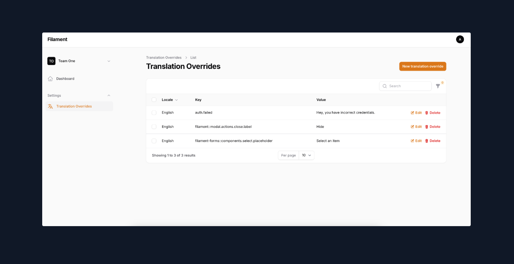

# Translation Overrides for Filament

A Filament plugin that enables Translation Overrides management in Laravel applications with an elegant admin interface. Supports both multi-tenant and single-tenant applications.



## Features

- Built-in Filament admin panel for managing translations
- Support for both multi-tenant and single-tenant applications
- Per-tenant translation management in multi-tenant setups
- Global translation overrides for single-tenant applications
- Seamless integration with Filament resources and panels
- Support for multiple languages with easy switching
- Support for vendor/package translations (`lang/vendor/*`)
- Performance-optimized with automatic caching
- Override translations without modifying Laravel's original translation files

## Requirements

- PHP 8.3+
- Filament 3.2+

## Installation

You can install the package via composer:

```bash
composer require jaysontemporas/translation-overrides
```

Publish the configuration file:

```bash
php artisan translation-overrides:install
```

This will publish the config file to `config/translation-overrides.php` and the migration file to create the Translation Overrides table.

> **Important**: Before running migrations, you should review and update the configuration file to set your preferred table name, tenancy mode, and other settings.

Run the migrations after configuring:

```bash
php artisan migrate
```

## Configuration

After publishing the configuration file, you can configure the package in `config/translation-overrides.php`:

```php
return [
    // Cache duration in seconds
    'cache_duration' => 21600, // 6 hours
    
    // Filament navigation settings
    'navigation' => [
        'group' => 'Settings',
    ],

    // Access control
    'can_access' => [
        'role' => 'Super Admin',
    ],

    // Tenancy configuration
    'tenancy_enabled' => false, // Set to true for multi-tenant apps

    // Your tenant model (only needed if tenancy_enabled is true)
    'tenant_model' => null, // \App\Models\Team::class
    
    // Table name for storing Translation Overrides
    'table_name' => 'translation_overrides',
    'tenant_id_column' => null, // Ex. tenant_id, only used if tenancy_enabled is true
    
    // Supported languages
    'supported_languages' => [
        'en' => 'English',
        'es' => 'Spanish',
        'fr' => 'French',
        // Add more languages as needed
    ],
];
```

## Usage

### For Single-Tenant Applications (Non-Tenancy)

If you're using this package in a single-tenant application, set `tenancy_enabled` to `false` in your configuration:

```php
// config/translation-overrides.php
return [
    'tenancy_enabled' => false,
    // ... other configuration
];
```

In this mode:
- No tenant relationship is created in the database
- All translation overrides are global to your application
- No tenant filtering in the admin interface
- The `HasTenantTranslation` contract is not required in your Model

### For Multi-Tenant Applications

If you're using this package in a multi-tenant application, ensure `tenancy_enabled` is `true`:

```php
// config/translation-overrides.php
return [
    'tenancy_enabled' => true,
    'tenant_model' => \App\Models\Team::class,

    'table_name' => 'translation_overrides',
    'tenant_id_column' => 'tenant_id',
    // ... other configuration
];
```

#### User Model Requirements (Multi-Tenant Only)

Your User model should implement the `HasTenantTranslation` contract:

```php
use JaysonTemporas\TranslationOverrides\Contracts\HasTenantTranslation;

class User extends Authenticatable implements HasTenantTranslation
{
    // ...
    
    public function getTranslationTenantId(): int|null
    {
        if (Filament::getTenant()) {
            return Filament::getTenant()->id;
        }

        return null;
        
        // OR in simple tenancy structure, users table has tenant_id
        // return $this->tenant_id;
    }
}
```

## Filament Integration

### Registering the Plugin

Add the TranslationOverrides plugin to your Filament panel:

```php
use JaysonTemporas\TranslationOverrides\TranslationOverridesPlugin;

public function panel(Panel $panel): Panel
{
    return $panel
        // ...
        ->plugins([
            TranslationOverridesPlugin::make(),
        ])
        // ...
}
```

This will automatically register the TranslationOverride resource in your Filament admin panel under the configured navigation group (default: "Settings").

### Customizing the Resource

You can override the default TranslationOverrideResource by creating your own resource class and configuring the plugin to use it. This is useful when you need to customize access controls, modify the interface, or add additional functionality.

#### Basic Usage

```php
use JaysonTemporas\TranslationOverrides\TranslationOverridesPlugin;

public function panel(Panel $panel): Panel
{
    return $panel
        ->plugins([
            TranslationOverridesPlugin::make()
                ->usingResource(CustomTranslationOverrideResource::class),
        ]);
}
```

#### Example: Custom Access Control

Create a custom resource class that extends the default one:

```php
use JaysonTemporas\TranslationOverrides\Filament\Resources\TranslationOverrideResource;

class CustomTranslationOverrideResource extends TranslationOverrideResource
{
    public static function canAccess(): bool
    {
        // Only allow super admins to access translation overrides
        return auth()->user()?->hasRole('super-admin');
    }
}
```

### Admin Interface

Once installed, you'll have access to a dedicated translations management interface in your Filament admin panel where you can:

**For Single-Tenant Applications:**
- Create, edit, and delete global translations
- Filter translations by language
- Search by translation key or value

**For Multi-Tenant Applications:**
- Create, edit, and delete tenant-specific translations
- Filter translations by language
- Search by translation key or value
- Assign translations to specific tenants

### User Model Requirements (For Multi-Tenant)

Your User model should implement the `HasTenantTranslation` contract:

```php
use JaysonTemporas\TranslationOverrides\Contracts\HasTenantTranslation;

class User extends Authenticatable implements HasTenantTranslation
{
    // ...
    
    public function getTranslationTenantId(): int
    {
        return Filament::getTenant()->id;
        
        // OR in simple tenancy structure, users table has tenant_id
        // return $this->tenant_id;
    }
}
```

### Using Translations in Your Application

After configuring the Filament interface, you can use translations in your views:

```php
// In blade templates
{{ __('message.greeting') }}

// In PHP code
__('message.greeting');
```

#### How It Works

This plugin provides a way to override translations without actually modifying Laravel's original translation files. When a translation key is requested:

**Single-Tenant Mode:**
1. The system first checks if a global translation override exists in the database
2. If found, it returns the custom translation
3. If not found, it falls back to Laravel's standard translation files

**Multi-Tenant Mode:**
1. The system first checks if a tenant-specific translation exists in the database
2. If found, it returns the tenant's custom translation
3. If not found, it falls back to Laravel's standard translation files

This approach allows you to:
- Customize translations without duplicating translation files
- Update translations through the admin interface without touching code
- Keep the original Laravel translations intact for reference or fallback

## Vendor Translations

This package supports vendor translations published by Laravel packages. When a package provides its own translations, they are typically published to:

```
lang/vendor/package-name/en
lang/vendor/package-name/es
```

The package automatically discovers and includes these vendor translations in your Translation Overrides management interface. Vendor translations will appear with their package name as a prefix (e.g., `package-name.file.key`).

To publish vendor translations from a package, you can use Laravel's standard vendor publish command:

```bash
php artisan vendor:publish --tag=package-name-translations
```

Once published, these translations will be automatically available in the translation management interface and can be customized per tenant (in multi-tenant mode) or globally (in single-tenant mode).


## License

The MIT License (MIT). Please see [License File](LICENSE.md) for more information.
